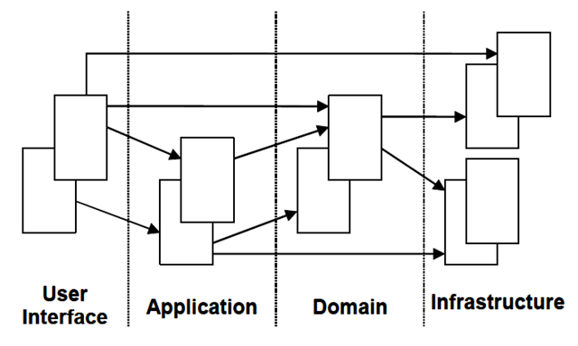

Exploration - (探索软件开发的方法论) A Exploration for the Methodology of Software Development  

内容提要
=======
* [前言](#前言)
* [DDD介绍](#DDD介绍)
    * [基本概念](#基本概念)
    * [分层架构](#分层架构)
* [DDD工程实践](#DDD工程实践)
    * [需求](#需求)
    * [战略建模](#战略建模)
    * [战术建模](#战术建模)
    * [架构设计](#架构设计)
* [总结](#总结)    
* [参考文献](#参考文献)
 
前言
===

至少30年以前，一些软件设计人员就已经意识到领域建模和设计的重要性，并形成一种思潮，Eric Evans将其定义为**领域驱动设计**（**Domain-Driven Design**，简称**DDD**）。

在互联网开发“小步快跑，迭代试错”的大环境下，**DDD**似乎是一种比较“古老而缓慢”的思想。

然而，由于互联网公司也逐渐深入实体经济，业务日益复杂，我们在开发中也越来越多地遇到传统行业软件开发中所面临的问题。

本项目以互联网中的一个真实需求为例，讲解如何利用**DDD**的思想设计和开发互联网业务需求。

因为只是讲解**DDD**的方法论，并不是讲解代码和业务，所以代码实现上只是设计了类及方法，没有实现里面具体的业务逻辑。

DDD介绍
======

基本概念
------
- **领域**(Domain)

- **限界上线文**(Bounded Context)

- **领域模型**(Domain Model)

- **通用语言**(Ubiquitous Language)

- **领域服务**(Domain Service)

- **实体**(Entity)

- **值对象**(Value Object)

- **聚合**(Aggregate)/**聚合根**(Aggregate Root)

- **工厂**(Factory)

- **资源库**(Repository)

分层架构
-------

用户界面/展示层：1）请求应用层获取用户所需的展示数据；2）发送命令给应用层执行用户的命令。

应用层：薄薄的一层，定义软件要完成的任务。对外为展示层提供各种应用功能，对内调用领域层（领域对象或领域服务）完成各种业务逻辑。应用层不包含业务逻辑。

领域层：表达业务概念、业务状态信息及业务规则，是业务软件的核心。

基础设施层：为其他层提供通用的技术能力，提供了层间通信；为领域层提供持久化机制。

DDD工程实践
=========

需求
---

[TODO]

战略建模
----

[TODO]

战术建模
----

[TODO]

架构设计
------

[TODO]

总结
===

[TODO]

参考文献
=======

[1] [领域驱动设计在互联网业务开发中的实践](https://zhuanlan.zhihu.com/p/32459776)

[2] [领域驱动设计的基础知识总结](https://www.cnblogs.com/butterfly100/p/7827870.html)

